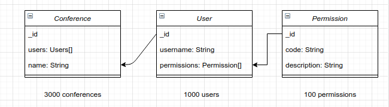
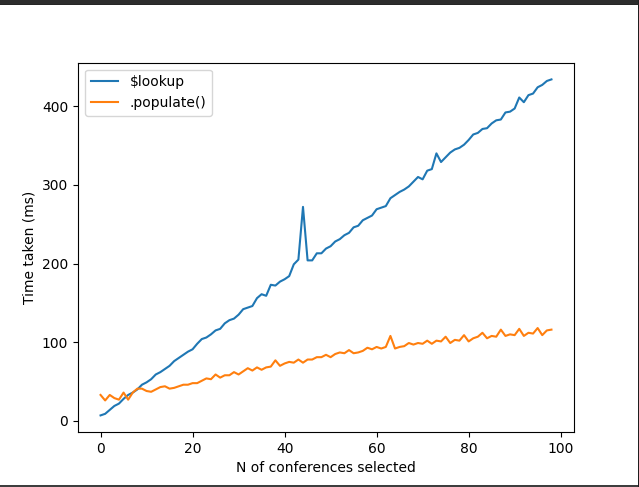
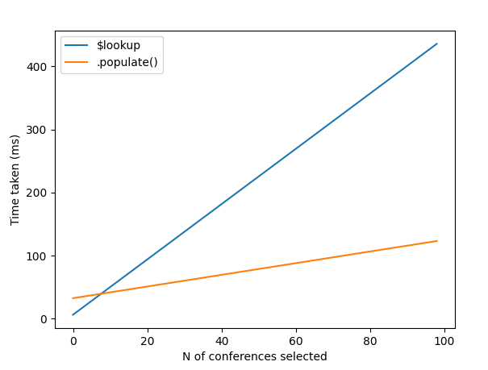

# MongoDB benchmark


## I.  Mongoose .populate() .vs native MongoDB aggregation ($lookup)
### **Description**

This benchmark to point out the differences between native MongoDB aggregation ($lookup) and Mongoose population based on document reference pattern.

Note:
1. Both benchmark models are rely on document-unique id constraint which have index as default pattern.
2. The metrics below should only be considered as reference, because the figure could be variant based on particular benchmark computer's specifications.

### **Requirements**
1. MongoDB running at port 27017
2. Python3 (w/ packages: matplotlib, sklearn, numpy)
3. NodeJS (w/ packages: mongoose)
### **Benchmark database diagram**

<span style="display:block;text-align:center"></span>


### **Benchmark**
 1. Seed database.

    At this point, I seed 3000 conferences, each conference with around 15-20 persons, each person has around 30-40 permissions.
    ```
    node seed.js
    ```

1.  Perform benchmark

    I start benchmark by starting a 1-100 loop test. In each loop, I get correspond n(loop index) conferences populated with users, and each user also populated with their own permissions.

    After running a benchmark, the metrics of .populate() and $lookup of each iteration written to *populate_data.json* and *lookup_data.json* respectively.

    ```
    node benchmark.js
    ```

2. Visualize data

    Running below command to visualize the metrics
    ```python3
    python3 plot.py
    ```

    A chart should be show up
<span style="display:block;text-align:center"></span>
    

    As we can seen, time spent recorded of each method increase linearly, so I picked Linear Regression as the model to normalize the recorded data.
    
    The chart with nomalized data should show up after running:

    ```python3
    python3 plot.py --lr
    ```
<span style="display:block;text-align:center"></span>

### **Conclusion**

In conclusion, when 'joining' multiple collections, the aggregation method ($lookup) only outperforms .populate() method with the limit range from 1-7 document(s) selected. But with higher number of conferences selected, the .populate() method apparently is the winner. So it depends on your database design, criteria, scaling plan and so forth, choose the approriate method.